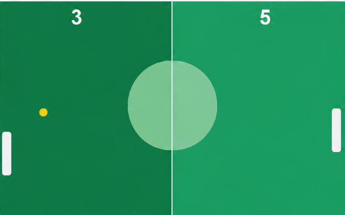

# 🏓 Ping / Pong Game — C++ OOP Project


A Pong game built in **C++** using **Raylib** with an AI-controlled opponent that automatically tracks and returns the ball. Focuses on game loop design, physics-based collision, and object-oriented structure.

The project focuses on game logic, object-oriented design, and real-time input handling. It helped me understand how game loops, collision detection, and object interactions work in a structured way.

---

## 🚀 Features

- 🏓 Smooth paddle movement  
- ⚽ Ball physics with bouncing mechanics  
- 🎯 Collision detection between ball and paddles  
- 🧠 Simple game loop structure  
- 🏆 Score tracking system  
- 🔄 Restart functionality  

---

## 🧠 Design / OOP Overview

| Concept | How I Applied It |
|:--------|:-----------------|
| **Abstraction** | Game elements (ball, paddles, game loop) are separated into logical parts |
| **Encapsulation** | Position, speed, and score are managed inside objects |
| **Modularity** | Code is structured into separate components/functions |
| **Game Loop Design**| Continuous update-render cycle for real-time gameplay |

---

## 🏗️ Architecture

```text
Game
│
├── Player Paddle
├── AI / Second Paddle
└── Ball (core physics object)
```

### 📁 Project Structure

```text
pong-game-cpp/
│
├── src/
│   └── pong.cpp      # Full game — ball, paddles, AI and game loop
│
├── assets/
│   └── gameplay.png  # Gameplay screenshot
│
└── README.md
```

---

## 🎮 Controls

| Key / Control | Action |
|:--------------|:-------|
| `W` / `S` | Move Player Paddle |
| `↑` / `↓` | Move Right Paddle *(or AI-controlled in single-player mode)* |
| `R` | Restart game |

---

## ⚙️ How to Run

### Requirements
- C++17 compatible compiler (G++)
- Raylib 5.5
- VS Code or any C++ IDE

### Compile & Run

**Using Terminal (Windows):**
```bash
g++ -std=c++17 src/main.cpp src/game.cpp src/paddle.cpp src/ball.cpp -o pong-game -lraylib -lopengl32 -lgdi32 -lwinmm
./pong-game
```
## 📸 Screenshots

### Gameplay


## 👨‍💻 Developer

**Kartar Singh** CS Student @ IBA Karachi  
GitHub: [https://github.com/kartar-singh-cs](https://github.com/kartar-singh-cs)

---

## 📌 Why I Built This

This project was my way of understanding how simple games are actually structured behind the scenes. 

While building it, I started to see how movement, collision, and object interaction all depend on a clean game loop. It also helped me get more comfortable with C++ OOP design and thinking in terms of objects instead of just functions.
